# 项目空投玩法调查

随着加密市场各种造富神话的不断涌现，布局未来空投，已经成为很多人博取高额收益的重要手段之一。

用户对于所有项目来说都非常重要。而对用户而言，未来空投的预期是前期吸引他们的重要手段。通过空投奖励过往用户，创造财富效应的同时，能够形成裂变，从而提高知名度并产生巨大传播效应，实现用户基数质的提升。

而随着区块链项目的不断的发展，项目空投也从最初的简单粗暴进阶到了越来越精细的玩法。接下来通过对一些典型的空投案例梳理，分析这些项目的空投规则，结合相关研究，探索未来空投的玩法和趋势。

## 一、顶级项目空投历史及规律

在刚刚过去的一轮牛市中，最大的四次现象级空投分别是 Uniswap 、dYdX、 ENS 、Optimism，无论是空投范围、空投金额、空投影响力都是空前的。

### （一）DeFi 爆发初期，DEX 两强流动性相争，诞生 UNI 里程碑式空投

2018 年 11 月 2 日，对未来 DeFi 产生深远影响的基础性应用 Uniswap 上线。到 2020 年中旬，市场活跃时，Uniswap 每天能产生上百万美元的手续费分配给做市商。但这时的 Uniswap 没有自己的 Token。

2020 年 8 月下旬，作为竞争对手的Sushiswap横空出世，凭借新特性「治理 Token 和更新的质押奖励，Sushiswap 通过用户质押 Uniswap 的 LP 分发其治理 Token 的方式，最终成功迁移 Uniswap 价值 8.1 亿美元的 TVL，约占 Uniswap 流动性的 55%，完成对 Uniswap 资金池的掠夺。

2020 年 9 月 17 日, Uniswap 在外部需要抗衡 Sushiswap，内部需要 DAO 治理的情况下，发布了其治理 Token UNI，并且基于 9 月 1 日的快照，对 251754 个地址空投 1.1 亿个 UNI。其中将总量的 10.06% 空投给早期 25 万用户、总量的 4.92% 空投给 49192 个早期 LP（流动性提供者）、总量的 0.02% 空投给 220 位 SOCKS 持有者，每个曾经调用过 Uniswap v1 或者 v2 合约的地址都可以申请 400 枚 UNI，以奖励他们过去所作出的贡献。

UNI 空投的方式相对粗犷，没有对交互设置很多限制。这是因为一方面当时 DeFi 用户量少，另一方面为了获得空投的批量地址交互意识还没有形成。

UNI 的空投产生于 DeFi 初期，其空投形式具有里程碑的意义，首先稳固了自身 DEX 龙头地位，其次巨大的传播效应吸引了更多加密市场用户开始关注 DeFi。另外空投也是对 DeFi 初期用户探索精神的一种奖励，这为未来更多人去参与 DeFi 新发展提供了动力。

### （二）DeFi 高潮期，完成 Layer2 部署的期货衍生品龙头 dYdX，开启史诗级的空投

2020 年到 2021 年 DeFi 经历了高速发展，这一时期应用层 dApp 爆发，各个赛道的龙头基本确立，去中心化的稳定币、交易平台、借贷应用逐渐被用户熟知和应用。而此时去中心化期货衍生品赛道被更多的用户了解和参与的需求日益增加，但是 DeFi 兴起之后的高 gas 费严重限制了其发展。

2021 年 2 月，dYdX 基于 StarkEx 可扩展性引擎和自身的 Perpetuals 智能合约，在以太坊的 Layer2 推出了交叉保证金永续合约平台。这使得它能够在提供更高的交易吞吐量和更低的最小订单量的同时，还能极大地降低用户的使用成本。此时它的交易性能几乎可以媲美中心化交易平台，而且可以承接更多的交易用户。这时的 dYdX 需要吸引更多的关注和用户，一场史诗级的空投即将酝酿产生。

2021 年 8 月 4 日，dYdX 宣布铸造了 10 亿治理 Token，其中 7.5%（共 7500 万 DYDX）空投给过往使用过该协议的 64306 个符合空投资格用户的地址。

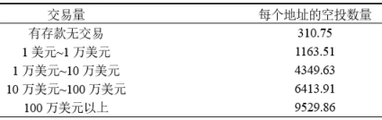

每个账户最低可领取到 310 DYDX，最高则有 9529 DYDX。而取得空投资格的用户，需在 dYdX 的 Layer 2 协议上完成相应的交易量才可领取奖励。

dYdX 的空投不再是无差别的，增加了根据交易量划分空投层级。这更加符合项目发展的需求，一方面让所有用户都获得基础性奖励，增加其口碑和传播效应，另一方面，给做出更大贡献的交易者提供更多的奖励，因为这批用户是 dYdX 的核心用户。

dYdX 的空投金额是空前的，其财富效应轰动了整个加密市场，极大的提高了项目的知名度。同时交易挖矿的上线，使得 dYdX 交易量迅速上涨，坐稳去中心化期货衍生品赛道龙头，而此时 DeFi 也进入上个周期最鼎盛的阶段。

### （三）Web3.0 逐渐展开叙事，域名系统 ENS 作为 DID 重要载体率先空投

2021 年 Q4 市场开始走弱，而加密行业未来方向逐渐从 DeFi 向更宏大的 Web3.0 发展。Web3.0 作为基于区块链的全新互联网想要普及，链上地址也急需优化，变成易于用户识别的语言形态。ENS 在区块链网络中，可以将数字和字母随机组成的以太坊地址与「.eth」结尾的域名，相互对应解析，可以极大提升使用体验。

2021 年 11 月 3 日，ENS 运营总监 Brantly Millegan 发文表示将发行治理 Token，总供应量的 25% 会空投给用户，还有 25% 会给 ENS 贡献者，符合资格的地址超过 13.7 万个。具体空投规则是：

- 空投分配给曾经注册过或目前有效的「.eth」二级域名注册地址
- 空投权重主要按账户而非域名数量计算
- 公式为 0.27 乘以至少持有 1 个 ENS 域名的天数，再加上 0.067 乘以距离域名到期的天数；如果账户额外设置了反向解析，则会将上述结果再乘以 2

ENS 的空投更加合理，做到了尽可能空投给域名的真实使用者，而非炒域名的投机者。其按照地址空投而不是按照域名数量，这有效防止了屯域名的羊毛党。而且持有天数作为参数，一方面有利于早期参与者、OG，他们持有天数更多，另一方面也有利于当前有效的域名，特别是已购买的长期域名。反向解析更是对真实用户的双倍激励。

大规模的空投、公平的空投机制、token 价格暴涨，让 ENS 域名服务瞬间走红，品牌效应随关注度的提升而提升，并且促使加密市场投资者开始关注 Web3.0。DID 作为 Web3.0 基础性应用，必然要率先发展，而 ENS 作为用户 DID 的关键载体，不可避免要冲在最前面。

### （四）Web3.0 进入公链发展期，Optimism 空投打响 Rollups 大战第一枪

以太坊在上个牛市中，拥堵和高 gas 费成为限制其生态发展的瓶颈。Optimistic Rollups 因为相对成熟的技术，引领着以太坊虚拟机（EVM）兼容 Optimistic Rollup 解决方案的发展，其率先空投，开始抢夺市场。

2022 年 4 月 27 日，Optimism 宣布了发行原生 Token，并于 2022 年 6 月 1 日进行了第一波空投。官方计划分配作空投的 OP 将占总发行量的 19%，6 月 1 日的空投只分发了总量 5% 的 OP，剩余 14% 将会在其余第二、三轮时间空投。这是大规模空投中首次分批。

Optimism 作为公链与之前的应用层项目空投有了明显区别，加大了生态活跃用户的空投奖励，而且空投的对象更为广泛。其中包括 Optimism 早期用户和活跃用户、以太坊重大 DAO 参与者、以太坊多重签名钱包使用者、Gitcoin 捐赠者、用过桥接功能的以太坊核心用户，而且如果满足超过 4 项，可以获得额外的「叠加奖励」。另外 Optimism 透过区块链分析工具以及 ENS 机器人捕捉提案，过滤了部分刷取交易量的与寻求空投的垃圾地址，尽可能地将空投缩小到真实用户与诚实的使用者。

Optimism 作为第一个大规模空投的公链项目，一方面增加了空投对象的类型，并且使用了分批空投，保留了对后期用户的激励，另一方面采用了反女巫攻击的检测。这对于后期项目空投有重要的参考作用，空投不仅仅针对简单批量的交互，而是交互、治理、捐赠、跨链一系列的行为，而且那些关联地址的批量交互将被剔除空投名单。空投不再简单激励短暂交互，而是需要长期陪伴生态发展的真实用户。

### （五）引爆熊市的一把火，Aptos主网上线空投，使冷淡的加密市场再次掀起热潮

随着市场走熊，不管是交易还是用户对新项目的参与度都变的不愠不火。同为Move语言开发的公链新秀Aptos和Sui，一直都有着不错的人气，谁能抢占优势意义不言而喻。
 
2022年10月18日，Aptos率先宣布主网上线。同时在19日，仓促宣布了代币空投计划。规则声明凡是完成 Aptos 激励测试网申请或铸造 APTOS:ZERO 测试网 NFT 的用户有资格申领 Aptos 代币（铸造 NFT 的原始用户有资格，而不是当前所有者）。参与激励网测试者可以申领300APT代币，而铸造了APTOS：ZERO测试网NFT的用户可以申领150APT代币。

尽管Aptos项目空投计划显得过于仓促，但由于处于熊市，强大的造富效应仍然为行业带来了极高的热度，很多用户争相参与到其生态项目中，在得到海量用户的同时也促进了生态的蓬勃发展。而每一次的热潮又都会吸引更多的用户参与进来，重新投入到下一个项目空投的布局中去。

从 Uniswap 的无限制空投，到 dYdX 设置空投梯次，再到 ENS 加入时间因子，以及后来的Optimism 的全方位跨时段空投，项目对于交互时长和交互广度的要求在不断提高。而随着越来越多的用户开始深度参与，市场上也出现了一批专业参与者。他们从信息整合、教程开发、工具使用、社群打造等方方面面形成了一些列的方法论。

## 空投信息获取及相关工具

### （一）空投信息网站

- [https://airdrops.io](https://airdrops.io)
标注了各种类型的空投信息、潜在空投的项目以及参与的条件。

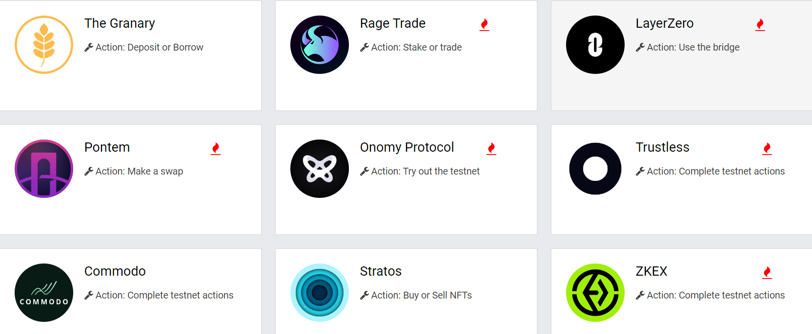

- [https://defillama.com/airdrops](https://defillama.com/airdrops)
标注了尚未发币的潜在空投项目及类型等信息。

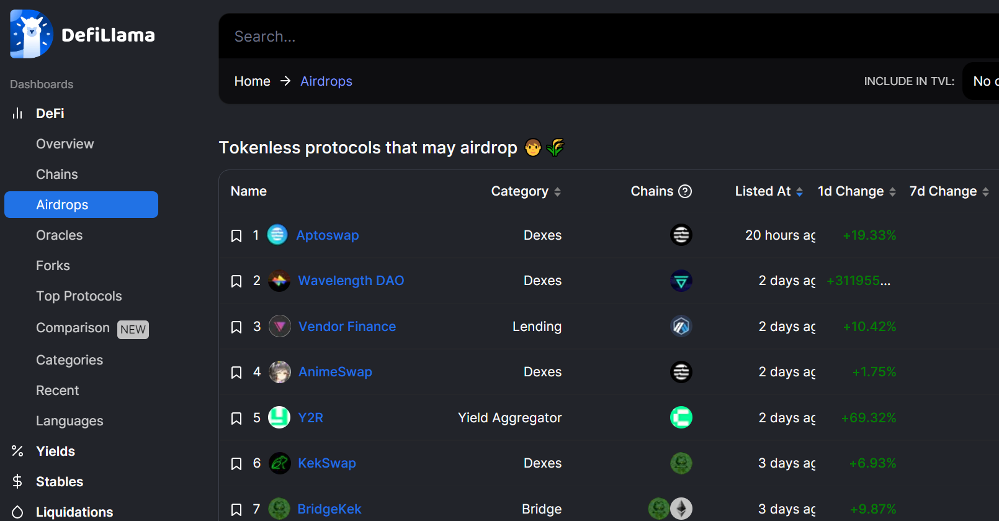

- [https://earndrop.io/](https://earndrop.io/)
未认领空投提醒

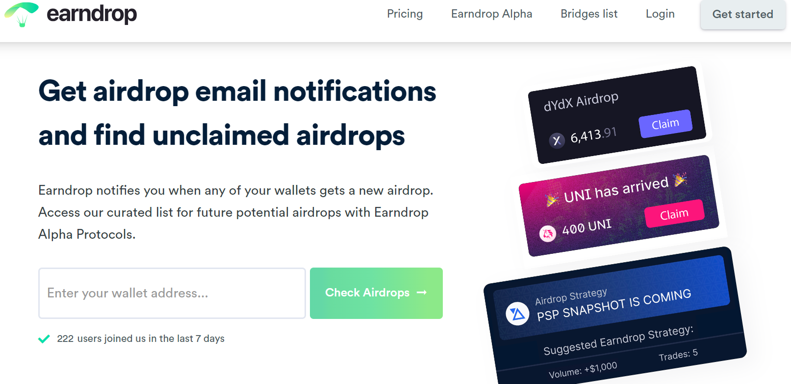

### （二）推特KOL

|  昵称 | 粉丝数  | 链接  |
|:-----------------------:|:---------------:|:-----------------------------------------:|
|  何币 | 13.4万  | [https://twitter.com/hebi555](https://twitter.com/hebi555) |
|  撸币养家 | 3.4万  | [https://twitter.com/lubi1666](https://twitter.com/lubi1666)  |
|  暴躁的希爷 | 2.4万  | [https://twitter.com/yakin168](https://twitter.com/yakin168)  |
|  Y林YourAirdrop | 2.5万  | [https://twitter.com/YourAirdropETH](https://twitter.com/YourAirdropETH)  |
| 马蹄橘子  | 3.8万  |  [https://twitter.com/bitcoinzhang1](https://twitter.com/bitcoinzhang1) |
|  元宇宙阿Q |  3.1万 | [https://twitter.com/Atirisvvvvv](https://twitter.com/Atirisvvvvv)  |
|  蓝衣侯-投资笔记 | 5.2万  | [https://twitter.com/lanyihou](https://twitter.com/lanyihou)  |
| sanyi.eth  | 4.3万  | [https://twitter.com/ylm5573](https://twitter.com/ylm5573)  |
|  lilili.eth | 6.7万  | [https://twitter.com/dashutiaozi](https://twitter.com/dashutiaozi)  |
|  鉴叔 | 3.3万  | [https://twitter.com/jianshubiji](https://twitter.com/jianshubiji)  |
|  crypto指南针 | 8.3万  | [https://twitter.com/bishengkegs](https://twitter.com/bishengkegs)  |
| 凉粉小刀  | 4万  |  [https://twitter.com/liangfenxiaodao](https://twitter.com/liangfenxiaodao) |
| 链上达人  | 2.5万  | [https://twitter.com/wenxue600](https://twitter.com/wenxue600)  |
|  追风Lab | 2.5万  | [https://twitter.com/ZF_lab](https://twitter.com/ZF_lab)  |
| 一亿小目标  | 5.4万  | [https://twitter.com/Yiyixmb](https://twitter.com/Yiyixmb)  |
|  Greta008 | 2.8万  | [https://twitter.com/Greta0086](https://twitter.com/Greta0086)  |
|  加密鹰 |  14.5万 | [https://twitter.com/jiamiying](https://twitter.com/jiamiying) |

### （三）撸毛社区

|  社区名称 | discord  | telegram  |
|:-----------------------:|:---------------:|:-----------------------------------------:|
|  3amClub  |  [https://t.co/aV5F4VjD71](https://t.co/aV5F4VjD71) | -  |
|  8848社区 | [https://t.co/OSaBnabASv](https://t.co/OSaBnabASv)  | [http://t.me/TG8848Community](http://t.me/TG8848Community)  |
|  web3 club | [https://t.co/7Z6VogM2X7](https://t.co/7Z6VogM2X7)  |[https://t.co/RmhJtXqT04](https://t.co/RmhJtXqT04)   |
|  达人社区 | [https://t.co/LSCdOT99iX](https://t.co/LSCdOT99iX)  |  - |
|  追风社区 |  [https://t.co/mbxDpZgrtv](https://t.co/mbxDpZgrtv) | -  |
|  CandyDAO糖果社区 | [https://t.co/DPpWnd9s6P](https://t.co/DPpWnd9s6P)  |  - |
| web3大航海时代  | [https://t.co/bV9gkv8wVy](https://t.co/bV9gkv8wVy)  | -  |
| Biteye   | [https://discord.gg/62wVPCnJkr](https://discord.gg/62wVPCnJkr)  |  - |
|  老韭门 | [https://discord.com/invite/fvtgzVVQxS](https://discord.com/invite/fvtgzVVQxS)  | -  |
| 深浅club  | [https://t.co/bcJDNgy6iL](https://t.co/bcJDNgy6iL)  | [https://t.co/XvFi9E02qB](https://t.co/XvFi9E02qB)  |

### （四）其他工具类网站

- 【查融资信息】[https://crypto-fundraising.info/deal-flow/](https://crypto-fundraising.info/deal-flow/)
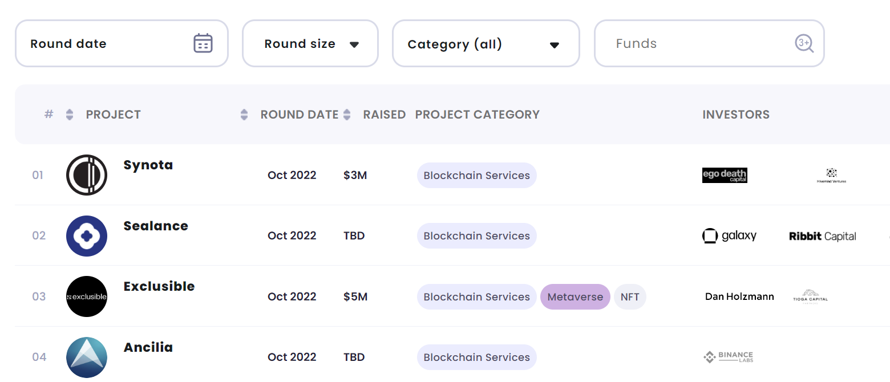

- 【查融资信息】[https://www.cypherhunter.com/en/](https://www.cypherhunter.com/en/)
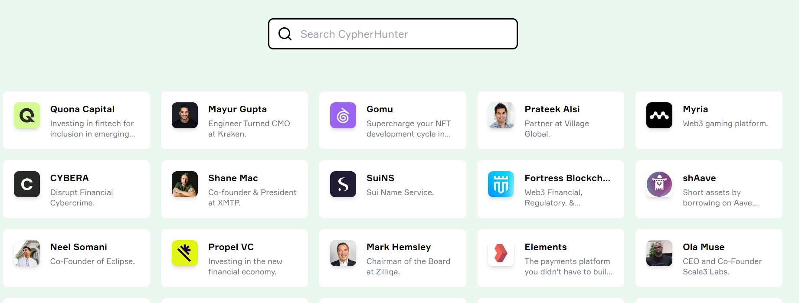

- 【数据分析】[https://dune.com/browse/dashboards](https://dune.com/browse/dashboards)
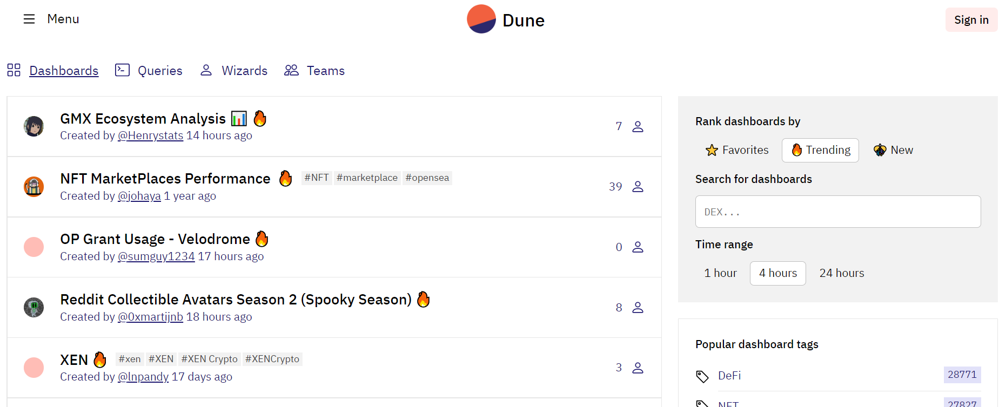

- 【Mirror搜索】（各种空投教程）[https://index3.io/](https://index3.io/)
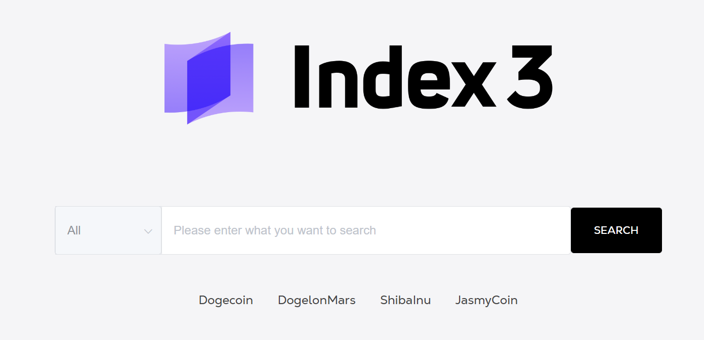

- 【链上工具集】[https://cointool.app/dashboard](https://cointool.app/dashboard)
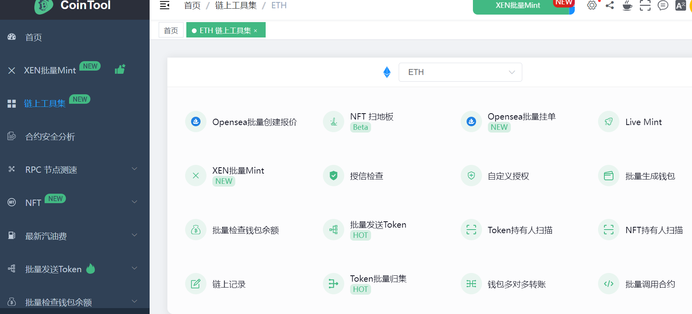

- 【一键添加网络】[https://chainlist.org/zh](https://chainlist.org/zh)
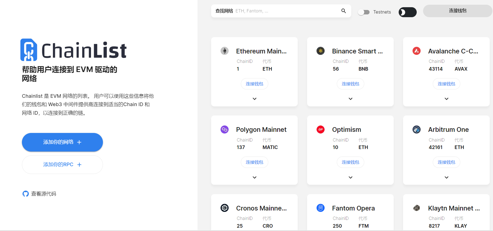

## 空投类型

根据空投的获取条件和方式不同，空投大致可以分为以下几类：

- 主网交互
这类空投一般发生在主网上线但尚未发币时，需要用户深度参与项目生态，因为交互需要支付gas费，参与成本较高，但通常空投的价值也会比较高。如Uniswap空投。

- 测试网交互
这类空投一般发生在主网尚未上线也未发币时，用户作为早期体验者参与项目进行测试，积极反馈bug以便项目方及时改进优化，当主网上线时空投代币进行奖励。因测试网交互只需用测试币，成本几乎为零，但这类空投一般价值较低，运气好的话也可遇到大毛，如Aptos空投。

- 参与质押
这类空投是为奖励项目生态质押者，通常会根据质押价值分配比例，资金成本较高。如质押Atom获得Cosmos生态的各类空投。

- 注册域名
注册域名获得空投资格，如ENS空投。

- 参与链上任务，领取OAT、NFT等链上凭证，从而获得空投资格
这类空投需要用户完成官方的指定任务，如关注Twitter、加入官方社群、投票、交互等等，完成任务后可以领取官方特制的nft作为空投资格。操作比较简单，但通常需要绑定社交媒体账号，不便多号操作。如Aptos空投就把铸造NFT一项列入了领取资格中。

## 内容任务平台及介绍

- **Project Galaxy**

Project Galaxy 致力于成为 Web3 世界的链上凭证基础平台，用户连接钱包登入后，即可在「Campaigns」页面看到正在进行的任务活动。做为Web3.0任务平台的龙头项目，很多高质量的项目前期在上面发行OAT、NFT等作为早鸟等凭证。

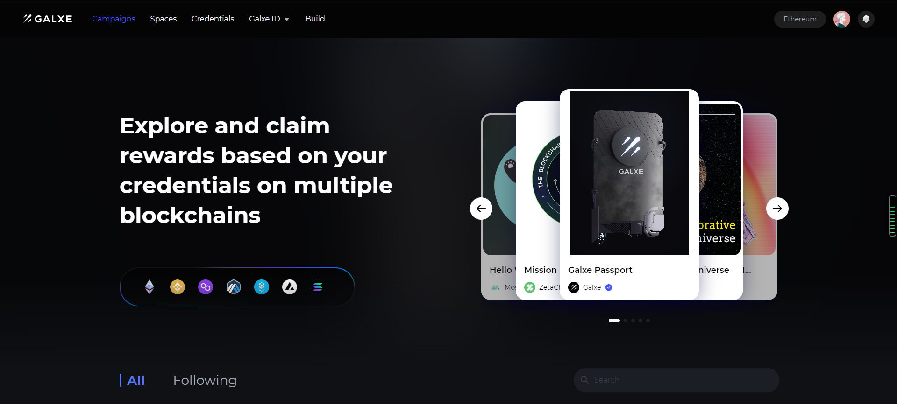

官方网站: [https://galxe.com/](https://galxe.com/)  

官方推特：[https://twitter.com/Galxe](https://twitter.com/Galxe)  

操作教程：[教程链接](https://mirror.xyz/0xF2eE2c1FF9A392c23C11664D12A5C656794B7081/-EN1OUAiyJTb4PhDM4Oz7O3AWAnVQpnZYc7ElaU_qgc)

- **Quest3**

Quest3 是一个 Web3 任务和事件平台。用户可以轻松在上面发现各类项目社区，并通过完成任务获取代币奖励和OAT奖励。

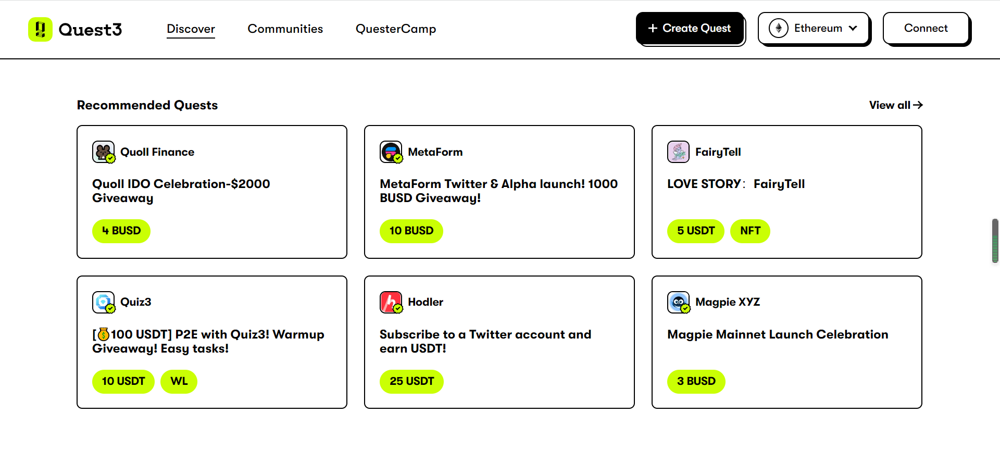

官方网站：[https://quest3.xyz/](https://quest3.xyz/)  

官方推特：[https://twitter.com/Quest3_xyz](https://twitter.com/Quest3_xyz)  

操作教程：[教程链接](https://mirror.xyz/xiaoyubtc.eth/E8LKYbyomGsoeA2aFAjoGCc2_Zql4aLIXj2EiX7uF7E)

- **RabbitHole**

RabbitHole 旨在通过游戏化思维，将每个去中心化应用分解为游戏任务，引导用户与区块链协议、去中心化应用进行交互，培育 DeFi 用户的使用习惯，同时用户的 Web3 操作和行为还将获得认证。

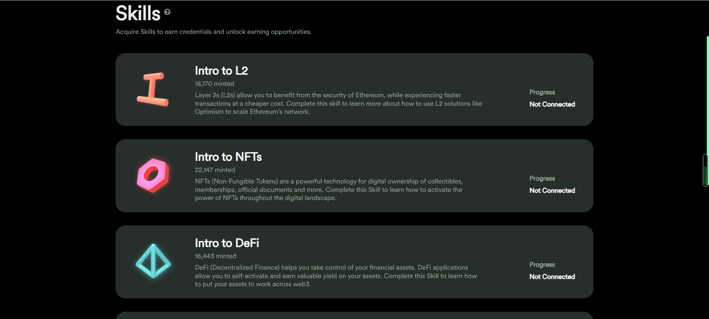

官方网站：[https://app.rabbithole.gg/skills](https://app.rabbithole.gg/skills)  

官方推特：[https://twitter.com/rabbithole_gg](https://twitter.com/rabbithole_gg)  

操作教程：[教程链接](https://mirror.xyz/0x5BD110DB21A2F7bB27845Faf7Ed41444338C9e11/TAm_e0BWZddYLTTu0s5iIN6et92pPjW7vwfDNRAcXak)

- **DappBack**

DappBack上都是早期项目，基本上为社交任务，比较简单，如关注项目Twitter，进入项目官方Telegram、Discord等，采用积分模式，达到一定分数后便可以领取NFT等奖励，整个交互模式更像是目前项目方常用的Gleam 填表。

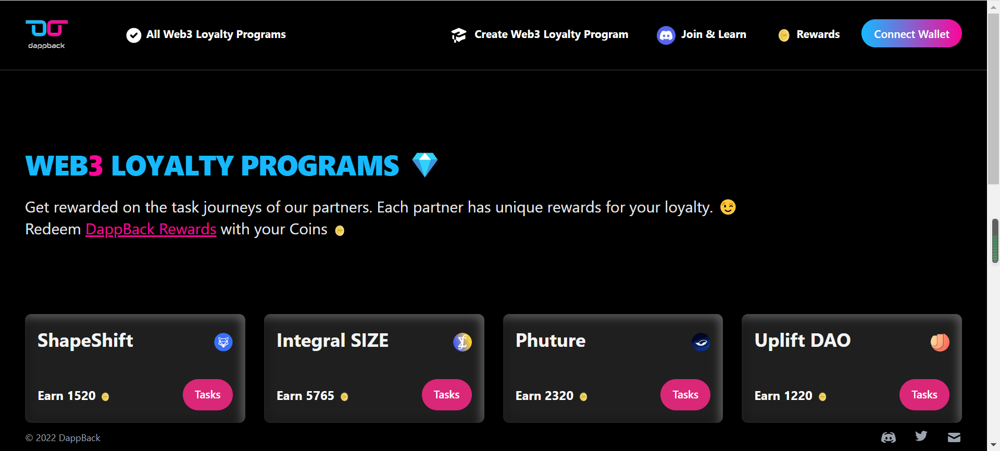

官方网站：[https://dappback.com/](https://dappback.com/)  

官方推特：[https://twitter.com/DappBackHQ](https://twitter.com/DappBackHQ)  

操作教程：[教程链接](https://mirror.xyz/0xD07e20a52b71cE9c911385D04c79a2418Bf04502/5arPKgh8qQOQhoGClXKucFS9W4enLsuWM6FwAirNb4k)

- **Layer3**

Layer3为致力于贡献 Web3 世界的用户提供敞口。目前 Layer3 提供了三类产品，分别为 Bounties、Contests 和 Projects。

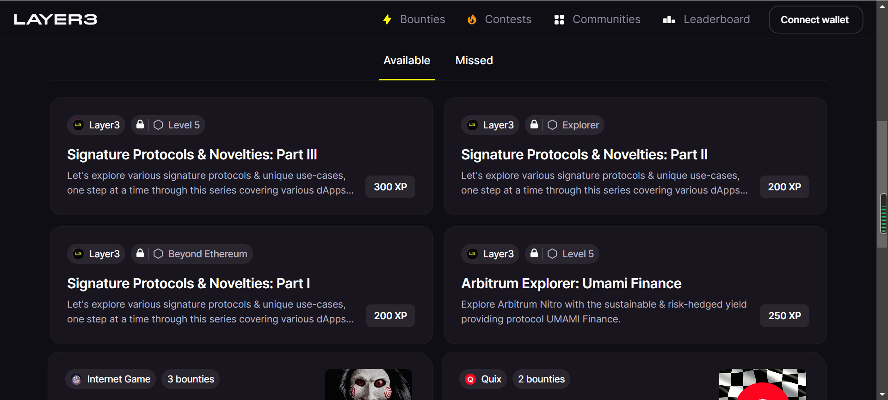

官方网站：[https://beta.layer3.xyz/](https://beta.layer3.xyz/)  

官方推特：[https://twitter.com/layer3xyz](https://twitter.com/layer3xyz)  

操作教程：[教程链接](https://foresightnews.pro/article/detail/9135)

## 防女巫攻击

由于空投能获得丰厚收益，因此很多职业撸毛者会建立成百上千个账号进行操作，从而获得巨量回报，但这类账号并不能反应用户的真实体验，而且会使项目方蒙受损失，因此很多项目会对空投资格获得者进行女巫审查。

以下行为被判定女巫的直接证据：
- IP地址相同
- 钱包间有转账，无论是1个钱包转多个，或者a转b、b转c、c转d，都算关联。
- 链上操作行为类似，比如30个钱包用相近的金额交互了相同的项目，或者同一时段内（可以是一周，也可以是一个月）按照顺序交互了几个相同的项目。
- 归集到同个钱包地址或者归集到同个交易所地址。
- 无论那条链被证明钱包关联，都会判定女巫。
- 同一个时间段，在同一个项目操作了类似金额的交互。

## 总结

1.	撸毛的用户量很多，未来也会继续增加。
2.	已经出现职业撸毛人以及社群，但信息相对庞杂、碎片化。
3.	方便撸毛最重要有两点：一是信息整合，二是工具整合
4.	如果Mixin能够集合从空投信息、操作教程、直达工具的一站式服务，将能够很好的满足用户痛点。

