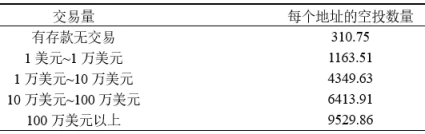
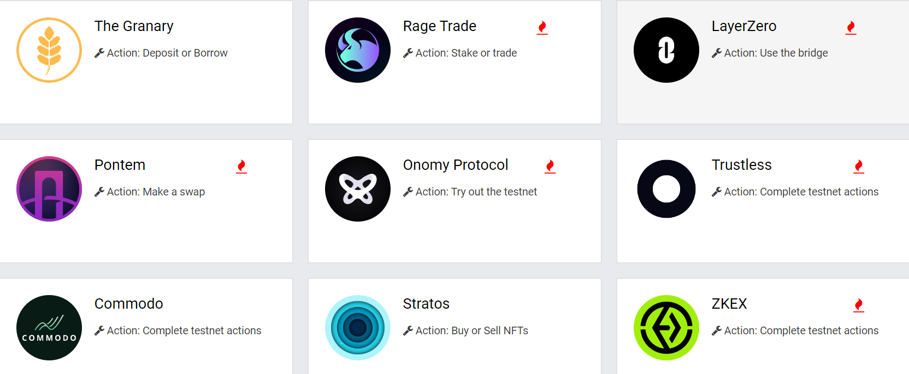
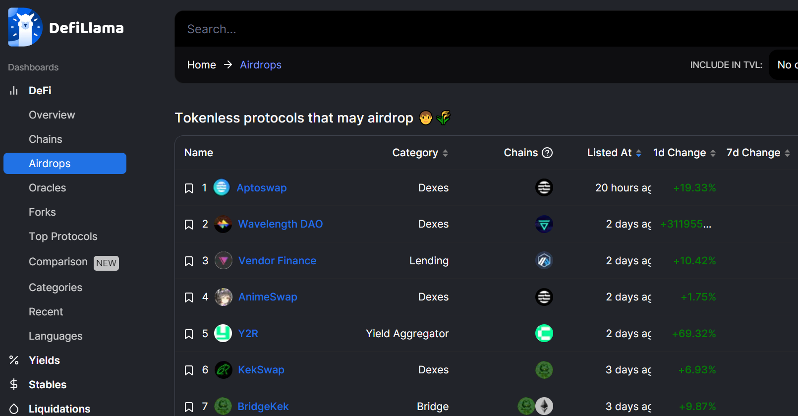

# 项目空投玩法研究

随着加密市场各种造富神话的不断涌现，布局未来空投，已经成为很多人博取高额收益的重要手段之一。

用户对于所有项目来说都非常重要。而对用户而言，未来空投的预期是前期吸引他们的重要手段。通过空投奖励过往用户，创造财富效应的同时，能够形成裂变，从而提高知名度并产生巨大传播效应，实现用户基数质的提升。

而随着区块链项目的不断的发展，项目空投也从最初的简单粗暴进阶到了越来越精细的玩法。接下来通过对一些典型的空投案例梳理，分析这些项目的空投规则，结合相关研究，探索未来空投的玩法和趋势。

## 一、顶级项目空投历史及规律

在刚刚过去的一轮牛市中，最大的四次现象级空投分别是 Uniswap 、dYdX、 ENS 、Optimism，无论是空投范围、空投金额、空投影响力都是空前的。

### （一）DeFi 爆发初期，DEX 两强流动性相争，诞生 UNI 里程碑式空投

2018 年 11 月 2 日，对未来 DeFi 产生深远影响的基础性应用 Uniswap 上线。到 2020 年中旬，市场活跃时，Uniswap 每天能产生上百万美元的手续费分配给做市商。但这时的 Uniswap 没有自己的 Token。

2020 年 8 月下旬，作为竞争对手的Sushiswap横空出世，凭借新特性「治理 Token 和更新的质押奖励，Sushiswap 通过用户质押 Uniswap 的 LP 分发其治理 Token 的方式，最终成功迁移 Uniswap 价值 8.1 亿美元的 TVL，约占 Uniswap 流动性的 55%，完成对 Uniswap 资金池的掠夺。

2020 年 9 月 17 日, Uniswap 在外部需要抗衡 Sushiswap，内部需要 DAO 治理的情况下，发布了其治理 Token UNI，并且基于 9 月 1 日的快照，对 251754 个地址空投 1.1 亿个 UNI。其中将总量的 10.06% 空投给早期 25 万用户、总量的 4.92% 空投给 49192 个早期 LP（流动性提供者）、总量的 0.02% 空投给 220 位 SOCKS 持有者，每个曾经调用过 Uniswap v1 或者 v2 合约的地址都可以申请 400 枚 UNI，以奖励他们过去所作出的贡献。

UNI 空投的方式相对粗犷，没有对交互设置很多限制。这是因为一方面当时 DeFi 用户量少，另一方面为了获得空投的批量地址交互意识还没有形成。

UNI 的空投产生于 DeFi 初期，其空投形式具有里程碑的意义，首先稳固了自身 DEX 龙头地位，其次巨大的传播效应吸引了更多加密市场用户开始关注 DeFi。另外空投也是对 DeFi 初期用户探索精神的一种奖励，这为未来更多人去参与 DeFi 新发展提供了动力。

### （二）DeFi 高潮期，完成 Layer2 部署的期货衍生品龙头 dYdX，开启史诗级的空投

2020 年到 2021 年 DeFi 经历了高速发展，这一时期应用层 dApp 爆发，各个赛道的龙头基本确立，去中心化的稳定币、交易平台、借贷应用逐渐被用户熟知和应用。而此时去中心化期货衍生品赛道被更多的用户了解和参与的需求日益增加，但是 DeFi 兴起之后的高 gas 费严重限制了其发展。

2021 年 2 月，dYdX 基于 StarkEx 可扩展性引擎和自身的 Perpetuals 智能合约，在以太坊的 Layer2 推出了交叉保证金永续合约平台。这使得它能够在提供更高的交易吞吐量和更低的最小订单量的同时，还能极大地降低用户的使用成本。此时它的交易性能几乎可以媲美中心化交易平台，而且可以承接更多的交易用户。这时的 dYdX 需要吸引更多的关注和用户，一场史诗级的空投即将酝酿产生。

2021 年 8 月 4 日，dYdX 宣布铸造了 10 亿治理 Token，其中 7.5%（共 7500 万 DYDX）空投给过往使用过该协议的 64306 个符合空投资格用户的地址。

每个账户最低可领取到 310 DYDX，最高则有 9529 DYDX。而取得空投资格的用户，需在 dYdX 的 Layer 2 协议上完成相应的交易量才可领取奖励。

dYdX 的空投不再是无差别的，增加了根据交易量划分空投层级。这更加符合项目发展的需求，一方面让所有用户都获得基础性奖励，增加其口碑和传播效应，另一方面，给做出更大贡献的交易者提供更多的奖励，因为这批用户是 dYdX 的核心用户。

dYdX 的空投金额是空前的，其财富效应轰动了整个加密市场，极大的提高了项目的知名度。同时交易挖矿的上线，使得 dYdX 交易量迅速上涨，坐稳去中心化期货衍生品赛道龙头，而此时 DeFi 也进入上个周期最鼎盛的阶段。

### （三）Web3.0 逐渐展开叙事，域名系统 ENS 作为 DID 重要载体率先空投

2021 年 Q4 市场开始走弱，而加密行业未来方向逐渐从 DeFi 向更宏大的 Web3.0 发展。Web3.0 作为基于区块链的全新互联网想要普及，链上地址也急需优化，变成易于用户识别的语言形态。ENS 在区块链网络中，可以将数字和字母随机组成的以太坊地址与「.eth」结尾的域名，相互对应解析，可以极大提升使用体验。

2021 年 11 月 3 日，ENS 运营总监 Brantly Millegan 发文表示将发行治理 Token，总供应量的 25% 会空投给用户，还有 25% 会给 ENS 贡献者，符合资格的地址超过 13.7 万个。具体空投规则是：

- 空投分配给曾经注册过或目前有效的「.eth」二级域名注册地址
- 空投权重主要按账户而非域名数量计算
- 公式为 0.27 乘以至少持有 1 个 ENS 域名的天数，再加上 0.067 乘以距离域名到期的天数；如果账户额外设置了反向解析，则会将上述结果再乘以 2

ENS 的空投更加合理，做到了尽可能空投给域名的真实使用者，而非炒域名的投机者。其按照地址空投而不是按照域名数量，这有效防止了屯域名的羊毛党。而且持有天数作为参数，一方面有利于早期参与者、OG，他们持有天数更多，另一方面也有利于当前有效的域名，特别是已购买的长期域名。反向解析更是对真实用户的双倍激励。

大规模的空投、公平的空投机制、token 价格暴涨，让 ENS 域名服务瞬间走红，品牌效应随关注度的提升而提升，并且促使加密市场投资者开始关注 Web3.0。DID 作为 Web3.0 基础性应用，必然要率先发展，而 ENS 作为用户 DID 的关键载体，不可避免要冲在最前面。

### （四）Web3.0 进入公链发展期，Optimism 空投打响 Rollups 大战第一枪

以太坊在上个牛市中，拥堵和高 gas 费成为限制其生态发展的瓶颈。Optimistic Rollups 因为相对成熟的技术，引领着以太坊虚拟机（EVM）兼容 Optimistic Rollup 解决方案的发展，其率先空投，开始抢夺市场。

2022 年 4 月 27 日，Optimism 宣布了发行原生 Token，并于 2022 年 6 月 1 日进行了第一波空投。官方计划分配作空投的 OP 将占总发行量的 19%，6 月 1 日的空投只分发了总量 5% 的 OP，剩余 14% 将会在其余第二、三轮时间空投。这是大规模空投中首次分批。

Optimism 作为公链与之前的应用层项目空投有了明显区别，加大了生态活跃用户的空投奖励，而且空投的对象更为广泛。其中包括 Optimism 早期用户和活跃用户、以太坊重大 DAO 参与者、以太坊多重签名钱包使用者、Gitcoin 捐赠者、用过桥接功能的以太坊核心用户，而且如果满足超过 4 项，可以获得额外的「叠加奖励」。另外 Optimism 透过区块链分析工具以及 ENS 机器人捕捉提案，过滤了部分刷取交易量的与寻求空投的垃圾地址，尽可能地将空投缩小到真实用户与诚实的使用者。

Optimism 作为第一个大规模空投的公链项目，一方面增加了空投对象的类型，并且使用了分批空投，保留了对后期用户的激励，另一方面采用了反女巫攻击的检测。这对于后期项目空投有重要的参考作用，空投不仅仅针对简单批量的交互，而是交互、治理、捐赠、跨链一系列的行为，而且那些关联地址的批量交互将被剔除空投名单。空投不再简单激励短暂交互，而是需要长期陪伴生态发展的真实用户。

### （五）引爆熊市的一把火，Aptos主网上线空投，使冷淡的加密市场再次掀起热潮

随着市场走熊，不管是交易还是用户对新项目的参与度都变的不愠不火。同为Move语言开发的公链新秀Aptos和Sui，一直都有着不错的人气，谁能抢占优势意义不言而喻。
 
2022年10月18日，Aptos率先宣布主网上线。同时在19日，仓促宣布了代币空投计划。规则声明凡是完成 Aptos 激励测试网申请或铸造 APTOS:ZERO 测试网 NFT 的用户有资格申领 Aptos 代币（铸造 NFT 的原始用户有资格，而不是当前所有者）。参与激励网测试者可以申领300APT代币，而铸造了APTOS：ZERO测试网NFT的用户可以申领150APT代币。

尽管Aptos项目空投计划显得过于仓促，但由于处于熊市，强大的造富效应仍然为行业带来了极高的热度，很多用户争相参与到其生态项目中，在得到海量用户的同时也促进了生态的蓬勃发展。而每一次的热潮又都会吸引更多的用户参与进来，重新投入到下一个项目空投的布局中去。

从 Uniswap 的无限制空投，到 dYdX 设置空投梯次，再到 ENS 加入时间因子，以及后来的Optimism 的全方位跨时段空投，项目对于交互时长和交互广度的要求在不断提高。而随着越来越多的用户开始深度参与，市场上也出现了一批专业参与者。他们从信息整合、教程开发、工具使用、社群打造等方方面面形成了一些列的方法论。

## 空投信息获取及相关工具

### （一）空投信息网站

- [https://airdrops.io](https://airdrops.io)
标注了各种类型的空投信息、潜在空投的项目以及参与的条件。

- [https://defillama.com/airdrops](https://defillama.com/airdrops)
标注了尚未发币的潜在空投项目及类型等信息。

### （二）推特KOL

|  昵称 | 粉丝数  | 链接  |
|:-----------------------:|:---------------:|:-----------------------------------------:|
|  何币 | 13.4万  | [https://twitter.com/hebi555](https://twitter.com/hebi555) |
|  撸币养家 | 3.4万  | [https://twitter.com/lubi1666](https://twitter.com/lubi1666)  |
|  暴躁的希爷 | 2.4万  | [https://twitter.com/yakin168](https://twitter.com/yakin168)  |
|  Y林YourAirdrop | 2.5万  | [https://twitter.com/YourAirdropETH](https://twitter.com/YourAirdropETH)  |
| 马蹄橘子  | 3.8万  |  [https://twitter.com/bitcoinzhang1](https://twitter.com/bitcoinzhang1) |
|   |   |   |
|   |   |   |
|   |   |   |
|   |   |   |
|   |   |   |
|   |   |   |
|   |   |   |
|   |   |   |
|   |   |   |
|   |   |   |
|   |   |   |

